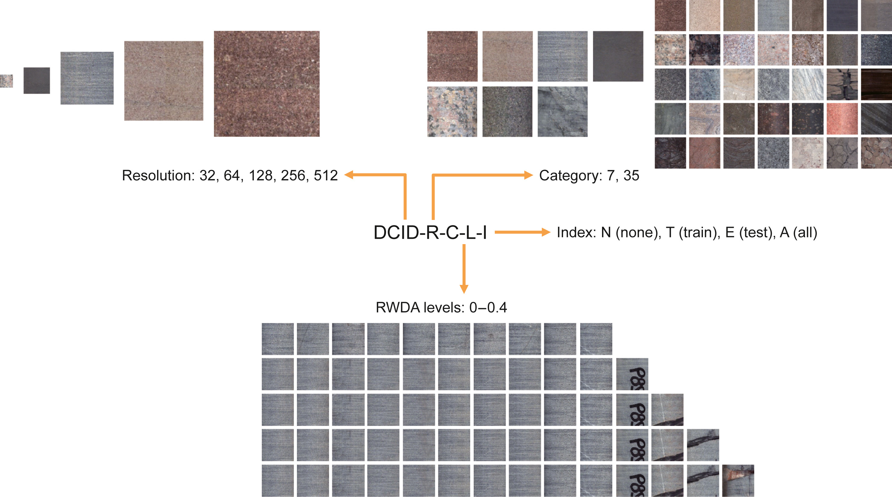
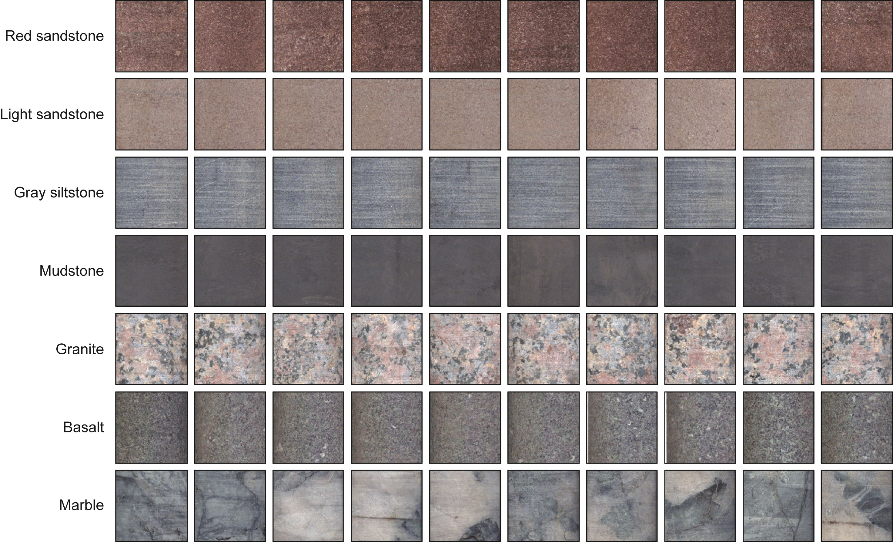
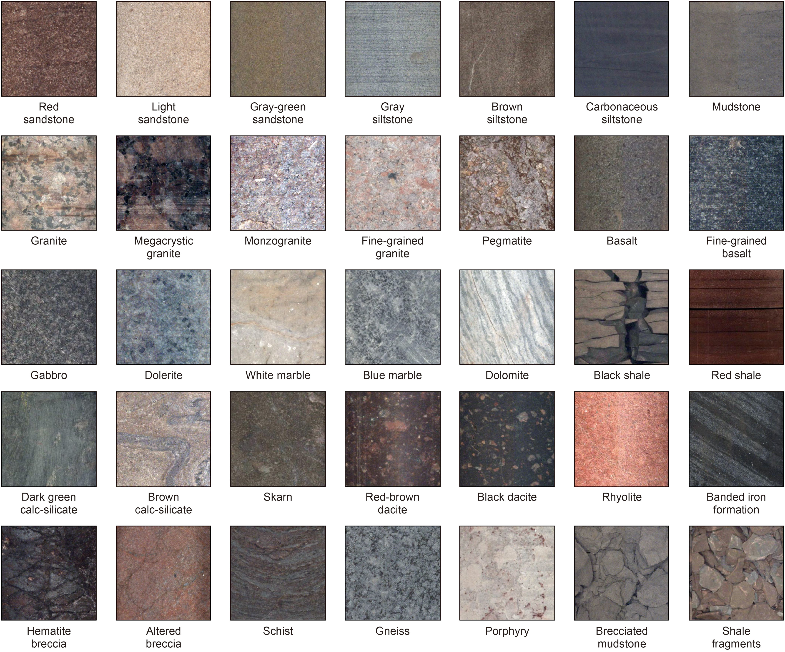

# Dataset Card for Drill Core Image Dataset (DCID)

## Dataset Details

### Dataset Description

The Drill Core Image Dataset (DCID) is a large-scale benchmark designed for lithology classification based on RGB core images. It provides two primary versions:

- **DCID-7**: 7 lithology categories with 5,000 images per class.
- **DCID-35**: 35 lithology categories with 1,000 images per class.

All original images are 512×512 pixels in resolution. Each category is split into training and testing subsets in an 8:2 ratio. Additional variants are generated by resizing to smaller resolutions (32, 64, 128, 256) and applying real-world data augmentation (RWDA) to simulate image imperfections.

- **Curated by:** Jia-Yu Li, Ji-Zhou Tang, et al.
- **Shared by:** Jia-Yu Li (lijiayu1120@tongji.edu.cn), Ji-Zhou Tang (jeremytang@tongji.edu.cn)
- **License:** CC BY-NC 4.0 (Creative Commons Attribution-NonCommercial 4.0)

---

### Visual Overview

#### DCID Naming Convention
The dataset naming follows the **DCID-R-C-L-I** format:
- `R`: resolution (32, 64, 128, 256, 512)  
- `C`: number of categories (7 or 35)  
- `L`: RWDA level (0.0 – 0.4)  
- `I`: injection scope (`N`, `T`, `E`, `A`)  



---

#### DCID-7 Dataset
The **DCID-7** dataset contains 35,000 images (5,000 per category).  
Each class has 4,000 training and 1,000 testing images (8:2 ratio).  
This version is suitable for evaluating model upper-bound performance.



---

#### DCID-35 Dataset
The **DCID-35** dataset contains 35,000 images (1,000 per category).  
Each class has 800 training and 200 testing images.  
This fine-grained version is designed to assess model generalization under complex conditions.



---

### Dataset Sources

- **GitHub Repository:** [https://github.com/JiayuLi1120/drill-core-image-dataset](https://github.com/JiayuLi1120/drill-core-image-dataset)  
- **Hugging Face Dataset:** [https://huggingface.co/datasets/168sir/drill-core-image-dataset](https://huggingface.co/datasets/168sir/drill-core-image-dataset)  
- **Paper:** [https://doi.org/10.1016/j.petsci.2025.04.013](https://doi.org/10.1016/j.petsci.2025.04.013)

---

## Usage

### Step 1: Download and extract
Download the `DCID.zip` archive from [Hugging Face](https://huggingface.co/datasets/168sir/drill-core-image-dataset) and extract it:

```bash
unzip DCID.zip -d ./DCID
````

This will give you the following folders:

* `DCID-512-7/` and `noise-512-7/`
* `DCID-512-35/` and `noise-512-35/`

---

### Step 2: Build custom dataset versions

We provide a script **`build_dcid_dataset.py`** to generate different dataset variants.

Example: Create a **32×32 resolution, 7 classes, 40% RWDA (train set only)** dataset:

```bash
python build_dcid_dataset.py \
    --root ./DCID \
    --R 32 \
    --C 7 \
    --L 0.4 \
    --I T \
    --out_dir ./output
```

This generates a new dataset at:

```
./output/DCID-32-7-0.4-T/
```

---

### Script Parameters

* **`R`**: target resolution (32, 64, 128, 256)
* **`C`**: number of categories (7 or 35)
* **`L`**: RWDA level (0.0–0.4)
* **`I`**: injection scope:

  * `N`: none
  * `T`: train set only
  * `E`: test set only
  * `A`: all (train + test)

---

## Citation

If you use this dataset in your work, please cite:

```bibtex
@article{Li2025DCID,
  title = {A large-scale, high-quality dataset for lithology identification: Construction and applications},
  author = {Jia-Yu Li and Ji-Zhou Tang and Xian-Zheng Zhao and Bo Fan and Wen-Ya Jiang and Shun-Yao Song and Jian-Bing Li and Kai-Da Chen and Zheng-Guang Zhao},
  journal = {Petroleum Science},
  year = {2025},
  issn = {1995-8226},
  doi = {10.1016/j.petsci.2025.04.013}
}

