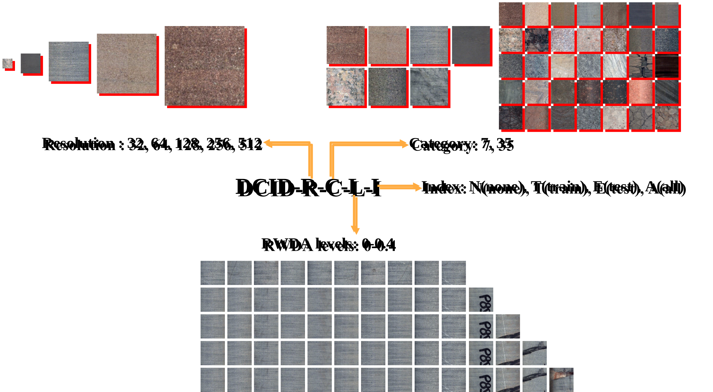

# drill-core-image-dataset

A large-scale, high-resolution image dataset for **lithology identification** based on RGB drill core photographs.  
The dataset supports tasks such as lithology classification, fine-grained rock recognition, and model robustness evaluation under real-world imaging conditions.

---

## 📦 Dataset Overview

The Drill Core Image Dataset (**DCID**) includes two core versions:

- **DCID-7**: 7 lithology categories, 5,000 images per class (35,000 total)
- **DCID-35**: 35 lithology categories, 1,000 images per class (35,000 total)

All images are 512×512 in resolution and divided into train/test sets (8:2 ratio).  
Variants are generated in the format `DCID-R-C-L-I`, where:

- `R`: image resolution (32, 64, 128, 256, 512)
- `C`: number of categories (7 or 35)
- `L`: real-world data augmentation level (e.g. 0.2 = 20% defective)
- `I`: injection scope (`N`=none, `T`=train only, `E`=test only, `A`=all)

---

## 📊 Dataset Statistics

### Overall Dataset Statistics



This figure shows the total image count and distribution across various DCID variants.

---

### DCID-7: 7 Lithology Categories


DCID-7 is balanced across 7 lithologies, each with 5,000 512×512 images.  
It serves as a lightweight benchmark for fast training and ablation studies.

---

### DCID-35: 35 Lithology Categories


DCID-35 is designed for fine-grained lithology recognition under class imbalance and inter-class visual similarity.

---

## 🚀 Download

You can download all dataset variants from **Hugging Face**:

🔗 [https://huggingface.co/datasets/YOUR_USERNAME/drill-core-image-dataset](https://huggingface.co/datasets/YOUR_USERNAME/drill-core-image-dataset)

**Example usage in Python:**

```python
from datasets import load_dataset

# Load a variant, e.g., DCID-64-7-0.2-T
dataset = load_dataset("YOUR_USERNAME/drill-core-image-dataset", name="DCID-64-7-0.2-T")
